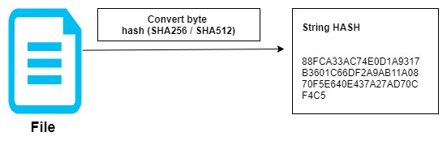
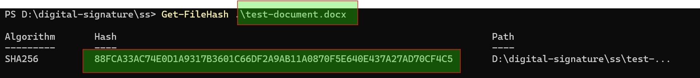
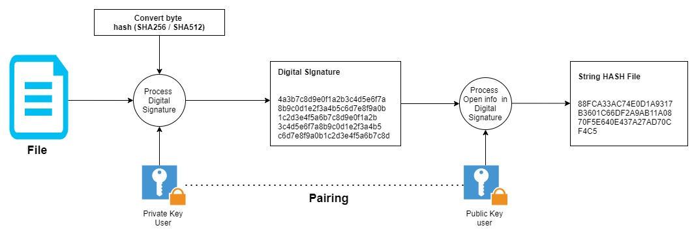
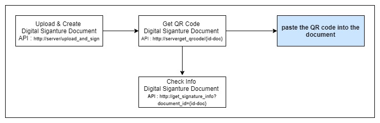
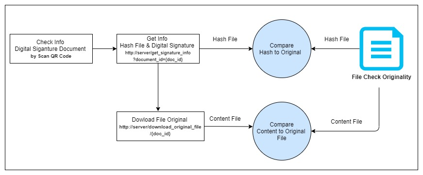
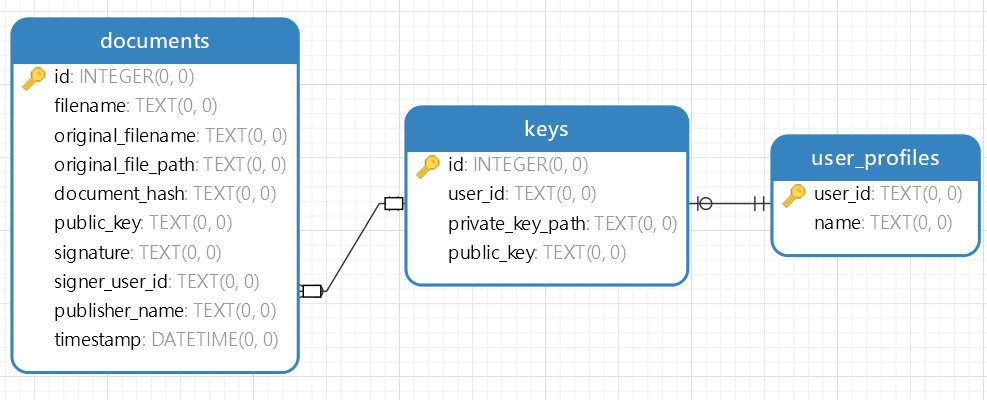
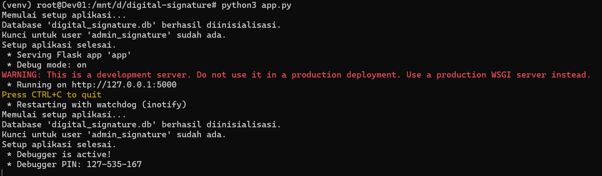
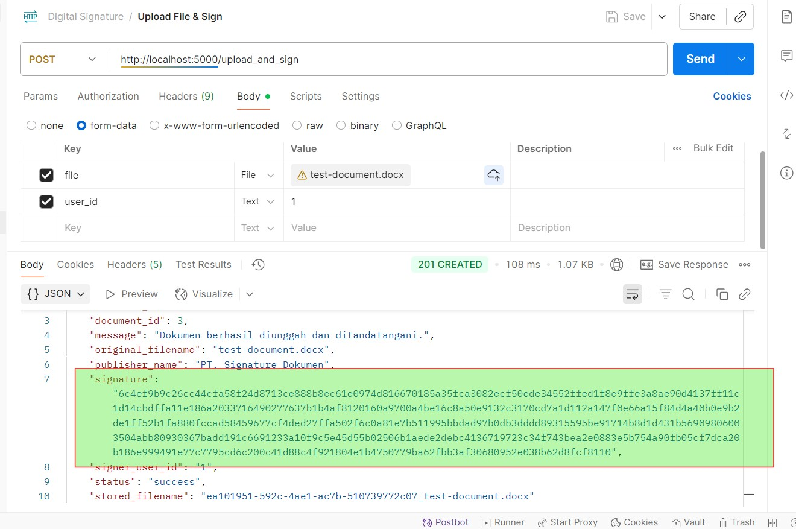
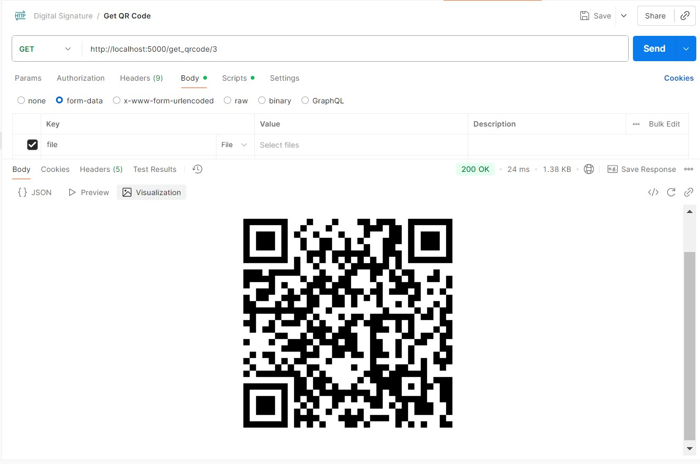
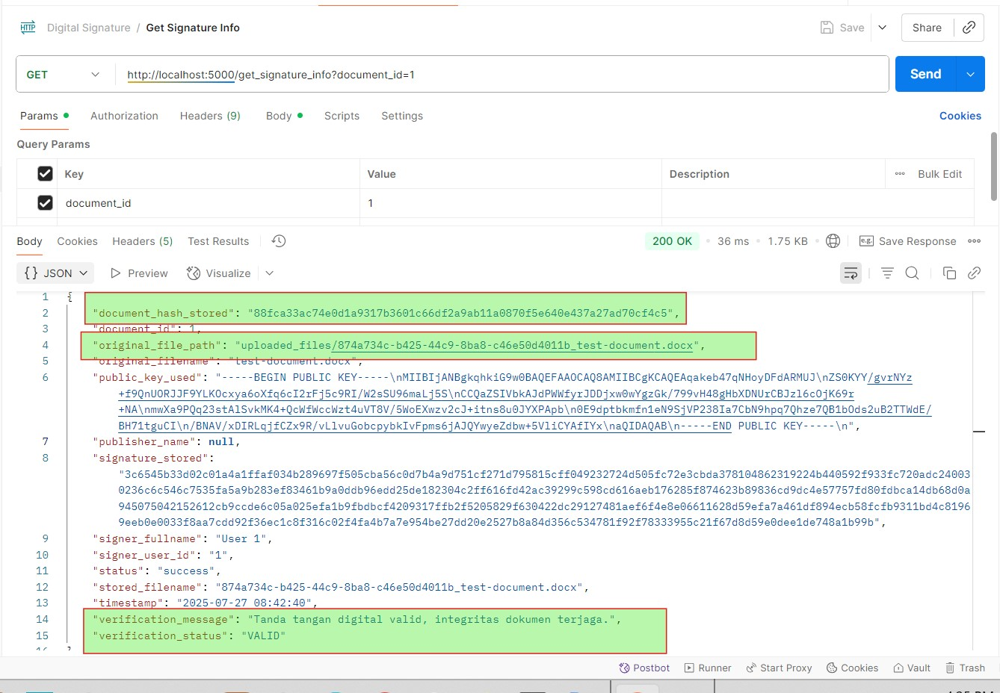

# Digital Signature Service: Ensuring Document Integrity in the Digital Age

In the vast ocean of digital information and transactions, how can we be sure that a document we receive is authentic, hasn't been tampered with, and truly comes from the source we expect? This is the crucial question answered by **Digital Signatures**. Imagine a world where every important document has a unique, unforgeable "digital fingerprint," ensuring its authenticity and integrity. This project is our step towards that world.

## Table of Contents
- [Digital Signature Service: Ensuring Document Integrity in the Digital Age](#digital-signature-service-ensuring-document-integrity-in-the-digital-age)
  - [Table of Contents](#table-of-contents)
  - [1. Concept of File Hash](#1-concept-of-file-hash)
  - [2. Concept of Digital Signature](#2-concept-of-digital-signature)
  - [3. Workflow for Creating \& Verifying Digital Signatures](#3-workflow-for-creating--verifying-digital-signatures)
  - [4. Digital Signature Service Architecture](#4-digital-signature-service-architecture)
  - [5. Installation and Usage Guide](#5-installation-and-usage-guide)
    - [Install Dependencies](#install-dependencies)
    - [Running the Application](#running-the-application)
    - [API Usage with Postman (or Similar Tools)](#api-usage-with-postman-or-similar-tools)
      - [1. Upload and Sign Document](#1-upload-and-sign-document)
      - [2. Get Document QR Code](#2-get-document-qr-code)
      - [3. Get Digital Signature Information](#3-get-digital-signature-information)
      - [4. Download Original Document](#4-download-original-document)


## 1. Concept of File Hash

Before understanding digital signatures, let's first grasp the "digital fingerprint" of a file: **File Hash**.



Here's how it works conceptually:

* **File as a Sequence of Bytes:** Every file on a computer, regardless of its type (text, image, video, program, etc.), is fundamentally stored as a series of binary numbers (0s and 1s). These binary numbers are grouped into bytes (one byte = 8 bits). So, a file is a long sequence of bytes.
* **Input to a Hash Function:** A hash function (like SHA256 or SHA512) takes this entire sequence of bytes as input.
* **Computation Process:** The hash algorithm then performs a series of complex mathematical operations (e.g., bit rotations, XOR, modular addition, compression) on these bytes. Every byte influences the subsequent calculation.
* **Hash Output:** The final result is a fixed-length hexadecimal string, which is the unique "digital fingerprint" of the original file's byte sequence. If even a single byte in the file changes, the resulting hash will be drastically different.



## 2. Concept of Digital Signature

A digital signature is a cryptographic mechanism that provides two main assurances: **integrity** (the document has not been altered) and **authenticity** (the document genuinely comes from the legitimate signer). It's like a wet-ink signature, but with much greater mathematical power.



Digital signatures work by using an asymmetric key pair:
* **Private Key:** Known only to the owner, used to "sign" the document's hash.
* **Public Key:** Can be shared widely with anyone, used to "verify" the signature created with its corresponding private key.


## 3. Workflow for Creating & Verifying Digital Signatures

How are documents signed and verified in this system? Let's look at the workflow:



**Signature Creation Workflow:**
1.  **Document Upload:** The user uploads a document to the service.
2.  **Key Generation (If Not Exists):** If the user doesn't already have a key pair, the system will automatically generate a private and public key for them. The private key is stored securely in a separate file, while the public key is stored in the database.
3.  **Document Hash Calculation:** The system calculates the hash (digital fingerprint) of the uploaded document.
4.  **Document Signing:** This document hash is then signed using the user's private key. The result is the digital signature.
5.  **Information Storage:** The original document is saved in the server's storage (with a unique name), and all related information (original filename, unique filename, document hash, signer's public key, digital signature, user ID, publisher name) is stored in the database.
6.  **QR Code:** A QR code is generated containing a direct link to the digital signature information of that document.




**Signature Verification Workflow:**
1.  **QR Code Scan:** The party wishing to verify scans the QR code on the document.
2.  **Signature Information Request:** The QR code directs to the service's API, which retrieves all digital signature metadata from the database based on the document ID.
3.  **Original Document Retrieval:** The user can download the original document they wish to verify.
4.  **Hash Recalculation:** The verification system recalculates the hash of the downloaded document.
5.  **Cryptographic Verification:** The public key obtained from the API is used to verify the digital signature against the newly calculated document hash. If they match, the document is valid and has not been altered.


## 4. Digital Signature Service Architecture

This service is designed with a modular architecture to separate responsibilities and facilitate development.


**Key Components:**

* **`app.py` (API Service):**
    * This is the heart of the service, functioning as a *REST API* using the Flask framework.
    * Handles all HTTP requests from clients (e.g., upload document, download document, get signature info, get QR code).
    * Orchestrates interactions between `key.py`, `generate.py`, and `database.py` components.
* **`key.py` (Key Management):**
    * Responsible for generating RSA key pairs (private and public).
    * Private keys are stored securely in separate files in the `private_keys/` directory.
    * The path to the private key and the public key are stored in the database.
    * Provides functions to retrieve private key content from files and public keys from the database.
* **`generate.py` (Signature & Verification Logic):**
    * Contains the core logic for:
        * Calculating document hashes (using SHA256).
        * Performing digital signing using the private key.
        * Performing digital signature verification using the public key.
        * Generating QR codes containing the document verification URL.
    * Interacts with `database.py` to store and retrieve document and signature metadata.
* **`database.py` (Database Initialization & Access):**
    * Manages the initialization of the SQLite database (`digital_signature.db`).
    * Defines the table schema:
        * `documents`: Stores signed document metadata, including unique filename, original filename, hash, signature, public key, signer ID, publisher name, and timestamp.
        * `keys`: Stores the path to private keys and public keys for each user.
        * `user_profiles`: Stores the full name of users associated with their `user_id`.
    * Provides functions to add sample user profiles and retrieve user names.
* **`uploaded_files/` (Storage Directory):**
    * The directory where original uploaded files are stored. Each file is saved with a unique name (UUID + original name) to prevent conflicts.
* **`private_keys/` (Private Key Storage Directory):**
    * The directory where private key files are stored.

**ERD (Entity-Relationship Diagram):**



* **`user_profiles`:**
    * `user_id` (PRIMARY KEY): Unique ID for each user.
    * `name`: Full name of the user.
* **`keys`:**
    * `id` (PRIMARY KEY): Unique ID for each key pair.
    * `user_id`: The ID of the user who owns this key (one user can have multiple keys).
    * `private_key_path`: Path to the private key file on the system.
    * `public_key`: Public key content in PEM format.
* **`documents`:**
    * `id` (PRIMARY KEY): Unique ID for each signed document.
    * `filename`: The unique filename stored in the `uploaded_files/` directory.
    * `original_filename`: The original filename uploaded by the user.
    * `original_file_path`: The full path to the unique file in storage.
    * `document_hash`: SHA256 hash of the document content.
    * `public_key`: The public key used to sign this document (stored directly for easy verification).
    * `signature`: The digital signature of the document.
    * `signer_user_id`: The ID of the user who performed the signing.
    * `publisher_name`: The name of the company/publisher of the signature.
    * `timestamp`: The time the document was signed.

## 5. Installation and Usage Guide

Follow these steps to install and run this digital signature service:

### Install Dependencies

Make sure you have Python 3 installed. Then, install all required libraries using `pip`:

```bash
pip install -r requirements.txt
````

The content of `requirements.txt` is:

```
Flask
cryptography
qrcode[pil]
```

### Running the Application

After all dependencies are installed, you can run the Flask application:

```bash
python app.py
```



The application will run at `http://127.0.0.1:5000/` (or `http://localhost:5000/`).

### API Usage with Postman (or Similar Tools)

You can interact with the API using Postman, Insomnia, or `curl`.

#### 1\. Upload and Sign Document



  * **Endpoint:** `POST http://localhost:5000/upload_and_sign`
  * **Body:** `form-data`
      * `file`: Select the file you want to upload (e.g., `test-document.docx`). Ensure its TYPE is `File`.
      * `user_id`: Enter the user ID who will sign (e.g., `1` or `admin_signature`). Ensure its TYPE is `Text`.
      * `publisher_name` (Optional): Enter the company/publisher name (e.g., `PT. Contoh Digital`). Ensure its TYPE is `Text`. If left empty, it will default to "PT. Signature Dokumen".

#### 2\. Get Document QR Code



  * **Endpoint:** `GET http://localhost:5000/get_qrcode/<document_id>`
  * Replace `<document_id>` with the document ID you obtained from the `upload_and_sign` response.

The response will contain a Base64 encoded QR code image that you can decode and display. This QR code, when scanned, will direct to the `/get_signature_info` endpoint for that document.

#### 3\. Get Digital Signature Information



  * **Endpoint:** `GET http://localhost:5000/get_signature_info`
  * **Params:**
      * `document_id`: Enter the document ID (e.g., `1`).
      * OR `filename`: Enter the unique filename stored in storage (obtained from the `upload_and_sign` response in the `stored_filename` field).

The response will display all digital signature details, including verification status, document hash, public key used, signer's full name, and publisher name.

#### 4\. Download Original Document


  * **Endpoint:** `GET http://localhost:5000/download_original_file/<document_id>`
  * Replace `<document_id>` with the document ID you obtained from the `upload_and_sign` response.

This will download the original file stored on the server. You can calculate the hash of this downloaded file locally and compare it with the `document_hash_stored` obtained from the `/get_signature_info` API for manual verification.
